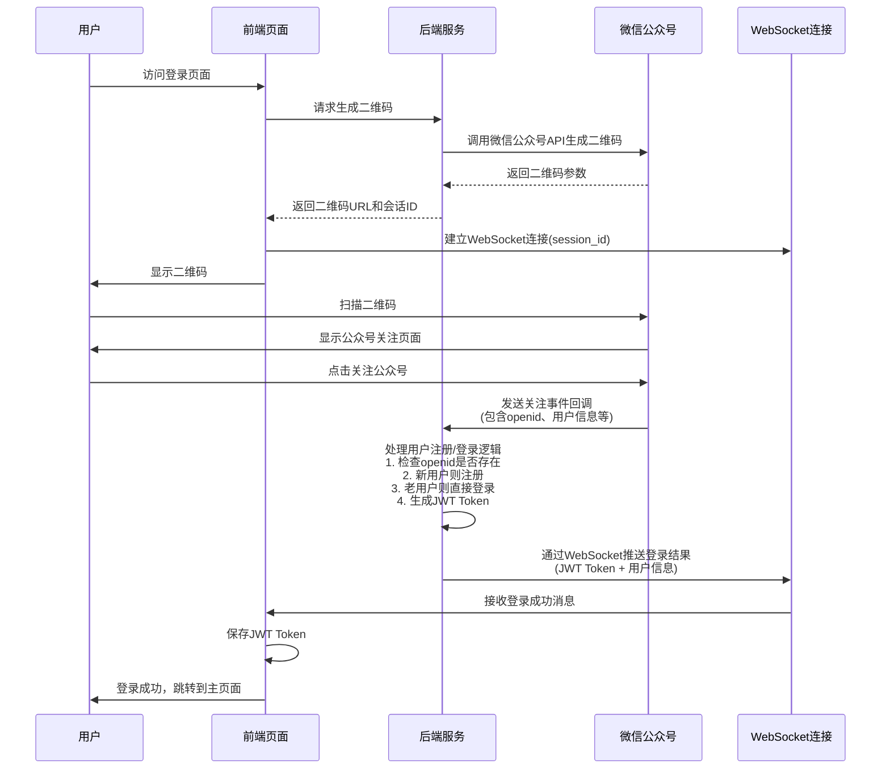

# 微信扫码登录功能设计文档

## 1. 功能概述

### 1.1 功能描述
在现有手机号验证码登录基础上，新增基于微信公众号关注事件的扫码登录功能。用户扫描二维码关注公众号后，系统自动完成用户注册或登录，通过WebSocket实时推送登录结果，支持多种登录方式并存。

### 1.2 技术栈
- 后端框架：Gin (Go)
- 数据库：MySQL + Redis
- 微信公众号 API（临时二维码 + 事件回调）
- WebSocket（用于实时登录结果推送）
- JWT Token 身份验证（与现有登录系统兼容）

### 1.3 功能特点
- **简化登录流程**：扫码关注即登录，一步到位
- **统一用户体系**：微信用户与手机号用户数据关联
- **安全性高**：基于微信公众号官方认证 + JWT Token
- **用户体验佳**：无需记忆密码，关注即可使用
- **实时反馈**：WebSocket实时推送登录结果
- **用户粘性强**：用户关注公众号，便于后续运营
- **技术门槛低**：相比开放平台，公众号更容易申请和配置
- **向后兼容**：保留现有登录功能，平滑升级

## 2. 系统架构

### 2.1 登录流程图


### 2.2 整体架构图
```
用户浏览器 <-> 前端页面 <-> 后端API <-> 微信公众号
                |           |
                |           v
                |        Redis缓存
                |           |
                |           v
                |        MySQL数据库
```

### 2.3 核心组件
1. **二维码生成服务** - 生成微信公众号临时二维码
2. **微信事件处理服务** - 处理公众号关注事件回调
3. **用户认证服务** - 处理用户注册/登录逻辑
4. **WebSocket服务** - 实时推送登录状态和结果

## 3. 数据库设计

### 3.1 现有用户表保持不变 (users)
```sql
-- 现有users表结构保持不变，不添加任何微信相关字段
-- 保持原有的手机号验证码登录功能完整性
```

### 3.2 微信用户表 (wechat_users)
```sql
CREATE TABLE wechat_users (
    id BIGINT PRIMARY KEY AUTO_INCREMENT,
    uid BIGINT COMMENT '关联用户ID，关联users表的id字段',
    openid VARCHAR(64) UNIQUE NOT NULL COMMENT '微信OpenID',
    nickname VARCHAR(100) COMMENT '微信昵称',
    avatar_url TEXT COMMENT '微信头像URL',
    subscribe_scene VARCHAR(50) COMMENT '关注场景',
    qr_scene VARCHAR(100) COMMENT '二维码场景值',
    subscribe_time TIMESTAMP DEFAULT CURRENT_TIMESTAMP COMMENT '关注时间',
    last_login_at TIMESTAMP DEFAULT CURRENT_TIMESTAMP COMMENT '最后登录时间',
    created_at TIMESTAMP DEFAULT CURRENT_TIMESTAMP,
    updated_at TIMESTAMP DEFAULT CURRENT_TIMESTAMP ON UPDATE CURRENT_TIMESTAMP,
    INDEX idx_uid (uid),
    INDEX idx_openid (openid),
    INDEX idx_qr_scene (qr_scene),
    INDEX idx_subscribe_time (subscribe_time),
    FOREIGN KEY (uid) REFERENCES users(id) ON DELETE SET NULL
);
```

### 3.3 登录会话缓存 (Redis)
```
# Redis中存储的登录会话数据结构
Key: wechat_login:session:{session_id}
Value: {
    "session_id": "string",
    "qr_scene": "string",        // 二维码场景值
    "status": "pending|success|expired",
    "user_id": "number",         // 登录成功后的用户ID
    "openid": "string",          // 微信openid
    "created_at": "timestamp",
    "expires_at": "timestamp"
}
Expire: 600 秒（10分钟）
```


## 4. API 接口设计

### 4.1 生成登录二维码
```
POST /api/auth/wechat/qr-code
```

**请求参数：**
```json
{
    "redirect_uri": "string" // 登录成功后的跳转地址（可选）
}
```

**响应数据：**
```json
{
    "success": true,
    "message": "二维码生成成功",
    "data": {
        "qr_url": "string",       // 二维码图片URL
        "session_id": "string",   // 会话ID（用于WebSocket连接）
        "qr_scene": "string",     // 二维码场景值
        "expires_in": 600         // 过期时间(秒)
    }
}
```

### 4.2 微信公众号事件回调
```
POST /api/auth/wechat/callback
```

**说明：** 此接口由微信公众号平台调用，用于接收用户关注事件

**请求数据：** 微信标准XML格式
```xml
<xml>
    <ToUserName><![CDATA[公众号原始ID]]></ToUserName>
    <FromUserName><![CDATA[用户openid]]></FromUserName>
    <CreateTime>1234567890</CreateTime>
    <MsgType><![CDATA[event]]></MsgType>
    <Event><![CDATA[subscribe]]></Event>
    <EventKey><![CDATA[qrscene_场景值]]></EventKey>
    <Ticket><![CDATA[二维码ticket]]></Ticket>
</xml>
```

**响应数据：**
```xml
<xml>
    <ToUserName><![CDATA[用户openid]]></ToUserName>
    <FromUserName><![CDATA[公众号原始ID]]></FromUserName>
    <CreateTime>1234567890</CreateTime>
    <MsgType><![CDATA[text]]></MsgType>
    <Content><![CDATA[欢迎关注！您已成功登录。]]></Content>
</xml>
```

### 4.3 WebSocket 连接
```
WebSocket: /ws/auth/{session_id}
```

**说明：** 前端通过此WebSocket连接接收实时登录结果

**连接建立后接收的消息格式：**
```json
{
    "type": "login_result",
    "data": {
        "status": "success|failed|expired",
        "message": "string",
        "user_info": {
            "user_id": "number",
            "nickname": "string",
            "avatar_url": "string",
            "login_type": "wechat"
        },
        "token": "jwt_token_string",
        "expires_in": 86400
    }
}
```


## 5. 核心代码结构

### 5.1 模型层 (Models)
- `User` - 保持现有用户模型不变
- `WechatUser` - 微信用户模型，通过uid字段关联User
- `LoginSession` - Redis中的登录会话结构

### 5.2 服务层 (Services)
- `UserService` - 扩展现有用户服务，支持微信登录
- `WechatAuthService` - 微信公众号认证服务
- `WechatQRService` - 微信临时二维码生成服务
- `WechatCallbackService` - 微信事件回调处理服务
- `WebSocketService` - WebSocket连接管理和消息推送服务
- `SessionService` - Redis会话管理服务

### 5.3 控制器层 (Controllers)
- `WechatAuthController` - 微信登录相关接口
- `WechatCallbackController` - 微信事件回调处理
- `WebSocketController` - WebSocket连接处理

### 5.4 中间件 (Middleware)
- `AuthMiddleware` - 扩展现有认证中间件
- `WechatSignatureMiddleware` - 微信签名验证中间件
- `RateLimitMiddleware` - 限流中间件

### 5.5 数据仓库 (Repository)
- `UserRepository` - 保持现有用户仓库不变
- `WechatUserRepository` - 微信用户仓库
- `SessionRepository` - Redis会话数据操作

## 6. 实现流程

### 6.1 微信公众号扫码登录流程
1. **前端请求生成二维码**
   - 调用 `POST /api/auth/wechat/qr-code` 接口
   - 后端生成唯一 `session_id` 和 `qr_scene`
   - 调用微信公众号API生成临时二维码
   - 将会话信息存储到Redis缓存
   - 返回二维码URL和session_id给前端

2. **前端建立WebSocket连接**
   - 使用session_id连接 `/ws/auth/{session_id}`
   - 等待接收登录结果推送

3. **用户扫码关注**
   - 用户扫描二维码
   - 跳转到公众号关注页面
   - 用户点击关注公众号

4. **微信事件回调处理**
   - 微信公众号向 `/api/auth/wechat/callback` 发送关注事件
   - 后端解析XML获取openid和qr_scene
   - 根据qr_scene找到对应的session_id

5. **用户认证和注册/登录**
   - 检查wechat_users表中是否存在该openid
   - **新用户**：创建User记录和WechatUser记录，建立关联
   - **老用户**：直接使用已有的用户信息
   - 生成JWT Token（与现有登录系统兼容）

6. **实时推送登录结果**
   - 通过WebSocket推送登录成功消息
   - 包含JWT Token和用户信息
   - 前端接收后保存Token并跳转

### 6.2 用户状态管理流程
1. **新用户注册流程**
   - 自动创建users表记录（基础用户信息）
   - 创建wechat_users表记录（微信相关信息）
   - 通过uid字段关联两张表

2. **老用户登录流程**
   - 通过openid查找wechat_users记录
   - 获取关联的uid找到users表记录
   - 更新last_login_at时间
   - 生成新的JWT Token

3. **会话管理流程**
   - Redis存储临时会话信息（10分钟过期）
   - WebSocket连接管理活跃会话
   - 登录成功后清理临时会话数据

### 6.3 多登录方式兼容流程
1. **保持现有手机号登录**：完全不变，继续使用现有逻辑
2. **新增微信登录**：通过openid关联到同一用户
3. **统一认证机制**：都使用相同的JWT Token格式
4. **用户体系统一**：微信用户和手机号用户共享users表

## 7. 安全考虑

### 7.1 数据安全
- 敏感信息加密存储
- 使用HTTPS传输
- 定期清理过期数据

### 7.2 接口安全
- 接口限流防刷
- 参数验证和过滤
- CSRF防护

### 7.3 会话安全
- 会话ID随机生成
- 设置合理的过期时间
- 支持会话撤销

## 8. 配置要求

### 8.1 扩展现有配置文件
在 `src/config/config.yaml` 中添加微信公众号配置：

```yaml
# 现有配置
jwt_secret: "${JWT_SECRET}"

# 新增微信公众号配置
wechat:
  app_id: "${WECHAT_APP_ID}"           # 公众号AppID
  app_secret: "${WECHAT_APP_SECRET}"   # 公众号AppSecret
  token: "${WECHAT_TOKEN}"             # 公众号Token（用于验证签名）
  callback_url: "${WECHAT_CALLBACK_URL}" # 事件回调URL
  qr_expires_in: 600                   # 临时二维码过期时间(秒)
  session_expires_in: 600              # 登录会话过期时间(秒)

# WebSocket配置
websocket:
  read_buffer_size: 1024
  write_buffer_size: 1024
  check_origin: true

# Redis配置（扩展现有配置）
redis:
  host: "${REDIS_HOST}"
  port: "${REDIS_PORT}"
  db: 0
  password: "${REDIS_PASSWORD}"
  key_prefix: "wechat_login:"
```

### 8.2 环境变量配置
在 `.env.api` 文件中添加：

```bash
# 现有配置
JWT_SECRET=your-super-secret-jwt-key-change-this-in-production

# 新增微信公众号配置
WECHAT_APP_ID=wx1234567890abcdef        # 从微信公众平台获取
WECHAT_APP_SECRET=1234567890abcdef12345678  # 从微信公众平台获取
WECHAT_TOKEN=your_wechat_token_here      # 自定义Token，用于验证消息来源
WECHAT_CALLBACK_URL=https://your-domain.com/api/auth/wechat/callback

# Redis配置
REDIS_HOST=localhost
REDIS_PORT=6379
REDIS_PASSWORD=
```

### 8.3 配置结构体扩展
在 `src/config/config.go` 中添加：

```go
type WechatConfig struct {
    AppID            string `mapstructure:"app_id"`
    AppSecret        string `mapstructure:"app_secret"`
    Token            string `mapstructure:"token"`
    CallbackURL      string `mapstructure:"callback_url"`
    QRExpiresIn      int    `mapstructure:"qr_expires_in"`
    SessionExpiresIn int    `mapstructure:"session_expires_in"`
}

type WebSocketConfig struct {
    ReadBufferSize  int  `mapstructure:"read_buffer_size"`
    WriteBufferSize int  `mapstructure:"write_buffer_size"`
    CheckOrigin     bool `mapstructure:"check_origin"`
}

type RedisConfig struct {
    Host      string `mapstructure:"host"`
    Port      int    `mapstructure:"port"`
    DB        int    `mapstructure:"db"`
    Password  string `mapstructure:"password"`
    KeyPrefix string `mapstructure:"key_prefix"`
}

type AppConfig struct {
    JWTSecret string          `mapstructure:"jwt_secret"`
    Wechat    WechatConfig    `mapstructure:"wechat"`
    WebSocket WebSocketConfig `mapstructure:"websocket"`
    Redis     RedisConfig     `mapstructure:"redis"`
}
```

## 9. 部署说明

### 9.1 环境要求
- Go 1.24+
- MySQL 8.0+
- Redis 6.0+
- 微信公众号（已认证）
- HTTPS域名（微信回调要求）

### 9.2 部署步骤
1. **配置微信公众号**
   - 登录微信公众平台（mp.weixin.qq.com）
   - 获取AppID和AppSecret（开发 > 基本配置）
   - 配置服务器地址：https://your-domain.com/api/auth/wechat/callback
   - 设置Token并启用服务器配置
   - 配置IP白名单（如果需要）

2. **配置服务器回调验证**
   - 微信会发送GET请求验证服务器
   - 需要正确响应echostr参数
   - 验证signature、timestamp、nonce

3. **更新配置文件**
   - 修改 `src/config/config.yaml`
   - 设置 `.env.api` 环境变量
   - 配置Redis连接信息
   - 配置WebSocket相关参数

4. **数据库迁移**
   ```sql
   -- 创建微信用户表
   CREATE TABLE wechat_users (
       id BIGINT PRIMARY KEY AUTO_INCREMENT,
       uid BIGINT COMMENT '关联用户ID',
       openid VARCHAR(64) UNIQUE NOT NULL COMMENT '微信OpenID',
       nickname VARCHAR(100) COMMENT '微信昵称',
       avatar_url TEXT COMMENT '微信头像URL',
       subscribe_scene VARCHAR(50) COMMENT '关注场景',
       qr_scene VARCHAR(100) COMMENT '二维码场景值',
       subscribe_time TIMESTAMP DEFAULT CURRENT_TIMESTAMP COMMENT '关注时间',
       last_login_at TIMESTAMP DEFAULT CURRENT_TIMESTAMP COMMENT '最后登录时间',
       created_at TIMESTAMP DEFAULT CURRENT_TIMESTAMP,
       updated_at TIMESTAMP DEFAULT CURRENT_TIMESTAMP ON UPDATE CURRENT_TIMESTAMP,
       INDEX idx_uid (uid),
       INDEX idx_openid (openid),
       INDEX idx_qr_scene (qr_scene),
       FOREIGN KEY (uid) REFERENCES users(id) ON DELETE SET NULL
   );
   ```

5. **启动应用服务**
   ```bash
   go run src/main.go
   ```

### 9.3 监控指标
- 二维码生成成功率
- 微信关注事件处理成功率
- 微信登录成功率
- WebSocket连接成功率
- 手机号登录成功率（现有功能）
- 接口响应时间
- Redis缓存命中率
- 错误率统计

### 9.4 兼容性说明
- ✅ 保留现有手机号验证码登录功能
- ✅ 新增微信扫码登录功能
- ✅ 支持两种登录方式并存
- ✅ 统一JWT Token认证机制
- ✅ 向后兼容现有API接口

## 10. 测试计划

### 10.1 单元测试
- 模型层测试（扩展现有User模型）
- 服务层测试（WechatAuthService、QRCodeService）
- 工具函数测试（微信API调用、Token生成）

### 10.2 集成测试
- API接口测试（微信登录、账号绑定）
- 数据库操作测试（wechat_users表、user_login_types表）
- Redis缓存测试（会话存储、状态管理）
- 现有登录功能兼容性测试
- 表关联关系测试

### 10.3 端到端测试
- 微信扫码登录完整流程测试
- 账号绑定和解绑流程测试
- 多登录方式切换测试
- 异常情况处理测试（网络异常、微信API异常）
- 性能压力测试

### 10.4 兼容性测试
- 现有手机号登录功能验证
- JWT Token兼容性验证
- 用户数据迁移验证
- API接口向后兼容验证

## 11. 后续优化

### 11.1 功能扩展
- 支持微信小程序登录
- 支持微信公众号登录
- 支持QQ、支付宝等第三方登录
- 多平台账号绑定和统一管理
- 登录方式偏好设置

### 11.2 性能优化
- Redis缓存优化（用户信息、会话状态）
- 数据库查询优化（索引优化、分页查询）
- 并发处理优化（微信API调用限流）
- 二维码生成性能优化

### 11.3 用户体验
- 登录状态持久化
- 自动登录功能
- 登录历史记录
- 登录安全提醒
- 异常登录检测

### 11.4 安全性增强
- 微信账号绑定验证
- 登录设备管理
- 异常登录告警
- 账号安全等级评估

## 12. 与现有系统集成

### 12.1 现有功能保留
- ✅ 手机号验证码登录（`POST /api/login`）
- ✅ 发送验证码（`POST /api/send-code`）
- ✅ JWT Token认证机制
- ✅ 用户信息获取（`GET /api/user/profile`）

### 12.2 新增功能
- 🔄 微信扫码登录（`POST /api/auth/wechat/qr-code`）
- 🔄 微信登录状态检查（`GET /api/auth/wechat/status/{session_id}`）
- 🔄 微信账号绑定（`POST /api/user/bind-wechat`）
- 🔄 微信账号解绑（`POST /api/user/unbind-wechat`）

### 12.3 数据迁移策略
1. **零影响迁移**：现有users表完全不变，保持原有功能
2. **独立表设计**：微信用户数据存储在独立的wechat_users表中
3. **关联关系管理**：通过uid字段和user_login_types表管理关联关系
4. **可选绑定**：用户可选择是否绑定微信账号
5. **登录方式升级**：支持从单一登录方式升级为多登录方式

### 12.4 API兼容性
- 保持现有API接口不变
- 新增微信相关接口
- 统一响应格式
- 向后兼容现有客户端 